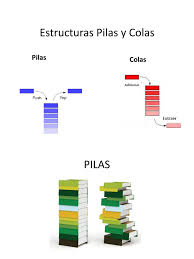

# Clase 4 - GIT Desarrollo Coplaborativo

## Git Stash

* exiten dentro de git
* no se pueden subir
* Trabaj con una estructura de pila



### listar los Stashes

```sh
git stash list
```

### Creando un stash

```sh
git stash -m "Mensaje"
```

### Ver contenido del stash

```sh
git stash show <Identificador-del-Stash>
git stash show 0
git stash show stash{0}
```

### Recuperar el stash

```sh
gits stash pop # recuepera el ultimo stash realizado si no hay conflictos lo borra
```

### Aplicar un stash en particulpar

```sh
git stash apply # aplicar el stash al de arriba
git stash apply 1 
git stash apply 2
```

### Eliminar un stash en particular

```sh
git stash drop # borra el de arriba
git stash drop 1
git stash drop 2
```

## GIT resests
Me permite deshacer commits. Hay 3 tipos 

### GIT RESET SOFT
Me permite hacer deshacer uno o varios commits y los cambios los devuelve al SA

```sh
git reset --soft <hash>
```

### GIT RESET MIXED (default)
Me permite deshacer uno o varios commits y los cambios los devuelve al WD

```sh
git reset <hash>
git reset --mixed <hash>
```

### GIT RESET HARD
Me permite deshacer uno o varios commits y los cambios los descarta (CUIDAD PIERDO LOS ARCHVIOS)

```sh
git reset --hard <hash>
```